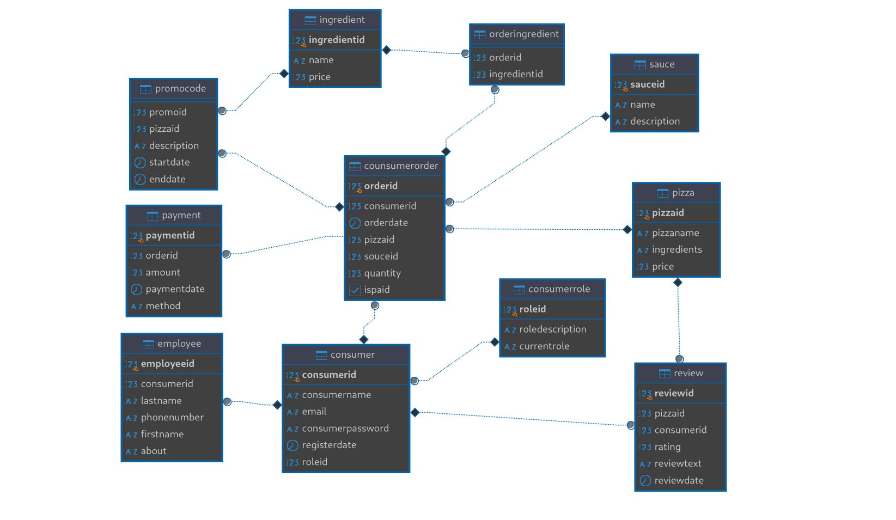

## Сервис: Пиццерия

### Функциональные требования:

- Аутентификация пользователя;
- Управление пользователями (CRUD);
- Система ролей;
- Журналирование действий пользователя;
- Добавление пицц в корзину, изменение количества, "оплата";
- Добавление дополнительных услуг (напитки, соусы) при покупке пиццы;
- Просмотр информации о пицце (название, ингредиенты, цена, отзывы);
- Изменение данных о пицце и ингредиентах;
- Фильтрация пицц по названию и ингредиентам;
- Просмотр информации о сотрудниках (Фамилия Имя, номер телефона, email, должность);
- Изменение должности сотрудников и мест, к которым они прикреплены.

### Сущности базы данных

- **User**
  - `userId`: INT NOT NULL AUTO_INCREMENT PRIMARY KEY
  - `username`: VARCHAR(15), NOT NULL
  - `email`: STRING, NOT NULL
  - `password`: BINARY(32) NOT NULL
  - `registerDate`: DATETIME, NOT NULL
  - `roleId`: INT FOREIGN KEY REFERENCES Role(roleId)

- **Employee**
  - `employeeId`: INT NOT NULL AUTO_INCREMENT PRIMARY KEY
  - `userId`: INT FOREIGN KEY REFERENCES User(UserId)
  - `lastName`: STRING
  - `phoneNumber`: VARCHAR(12)
  - `firstName`: STRING
  - `about`: STRING

- **Role**
  - `roleId`: INT NOT NULL AUTO_INCREMENT PRIMARY KEY
  - `role`: ENUM("customer", "admin", "employee") NOT NULL

------

- **Order**
  - `orderId`: INT NOT NULL AUTO_INCREMENT PRIMARY KEY
  - `customerId`: INT FOREIGN KEY REFERENCES User(userId)
  - `date`: DATEFIELD, NOT NULL
  - `pizzaId`: INT FOREIGN KEY REFERENCES Pizza(pizzaId)
  - `souceId`: INT FOREIGN KEY REFERENCES Sauce(sauceId)
  - `quantity`: DECIMAL(5,2), NOT NULL
  - `isPaid`: BOOLEAN, DEFAULT FALSE, NOT NULL

- **Review**
  - `ReviewId`: INT NOT NULL AUTO_INCREMENT PRIMARY KEY
  - `pizzaId`: INT FOREIGN KEY REFERENCES Pizza(pizzaId)
  - `userId`: INT FOREIGN KEY REFERENCES User(pserId)
  - `rating`: INT CHECK (rating >= 1 AND rating <= 5)
  - `comment`: STRING, NULL

- **OrderIngredient**
  - `orderId`: INT FOREIGN KEY REFERENCES Order(orderId)
  - `ingredientId`: INT FOREIGN KEY REFERENCES Ingredient(ingredientId)

- **PromoCode**
  - `promoId`: INT FOREIGN KEY REFERENCES Order(orderId)
  - `pizzaId`: INT FOREIGN KEY REFERENCES Ingredient(ingredientId)
  - `description`: STRING, NOT NULL
  - `startDate`: DATETIME, NOT NULL
  - `endDate`: DATETIME, NOT NULL

- **Sauce**
  - `souceId`: INT NOT NULL AUTO_INCREMENT PRIMARY KEY
  - `name`: VARCHAR(20) NOT NULL
  - `description`: TEXT
    
-----

- **Pizza**
  - `PizzaId`: INT NOT NULL AUTO_INCREMENT PRIMARY KEY
  - `name`: VARCHAR(30), NOT NULL
  - `ingredients`: STRING, NOT NULL
  - `price`: DECIMAL, NOT NULL

- **Ingredient**
  - `IngredientId`: INT NOT NULL AUTO_INCREMENT PRIMARY KEY
  - `name`: STRING, NOT NULL
  - `price`: DECIMAL(5,2), NOT NULL

- **Payment**
   - `PaymentId`: INT NOT NULL AUTO_INCREMENT PRIMARY KEY
   - `OrderId`: INT FOREIGN KEY NOT NULL REFERENCES Order(orderId)
   - `amount`: DECIMAL(5, 2), NOT NULL
   - `paymentDate`: DATETIME, NOT NULL
   - `method`: ENUM("credit_card", "paypal", "cash") NOT NULL
    
### Ненормализованная схема БД: 

---
